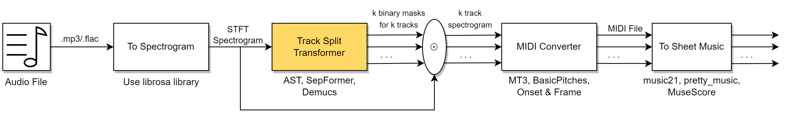

# audio-to-sheet-music
CS 7150 Final Project: Audio to Sheet Music Conversion using Transformer models

  <h1>Audio to Sheet Music Transcription</h1>
  
<i>Converting Audio Files</i>

  <!-- PyTorch Badge -->
  

  <!-- License Badge -->
  

  <!-- Dataset Badge -->
  

---
This repository tackles audio to sheet music conversion, specifically focusing on stem/track
separation and MIDI conversion
