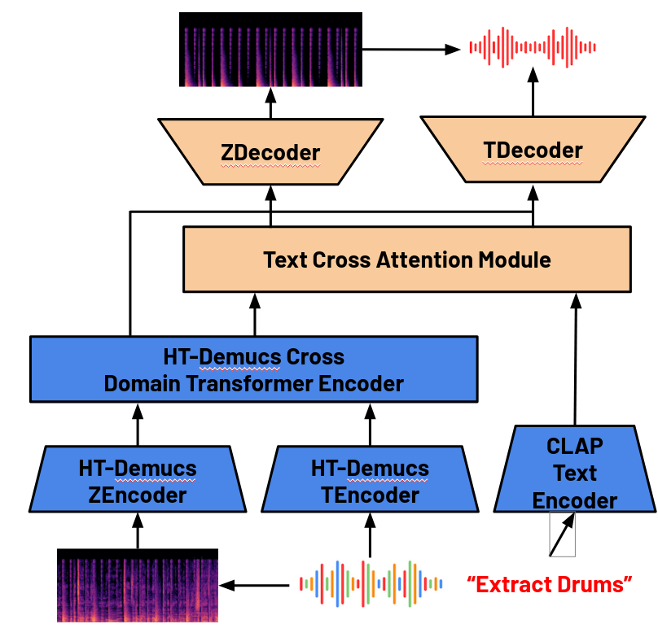
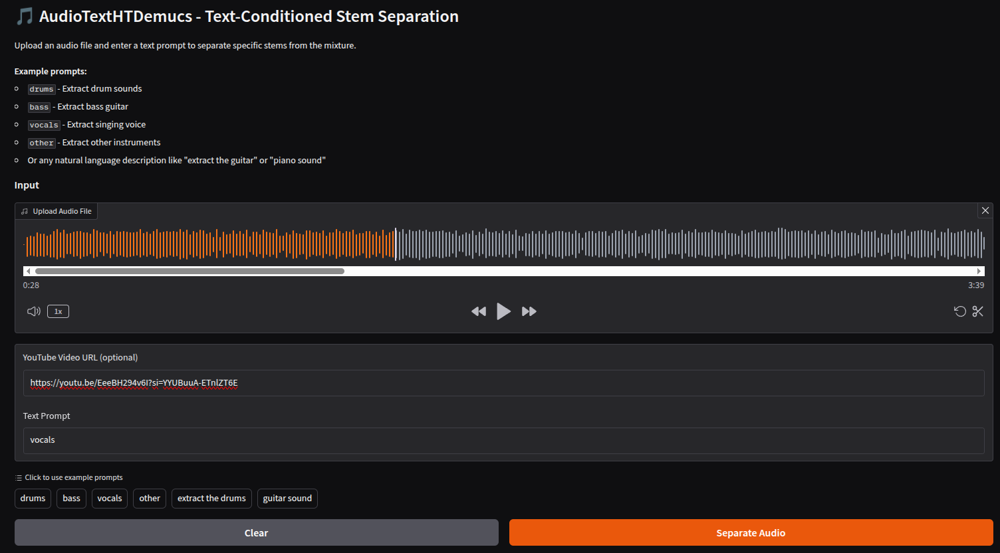
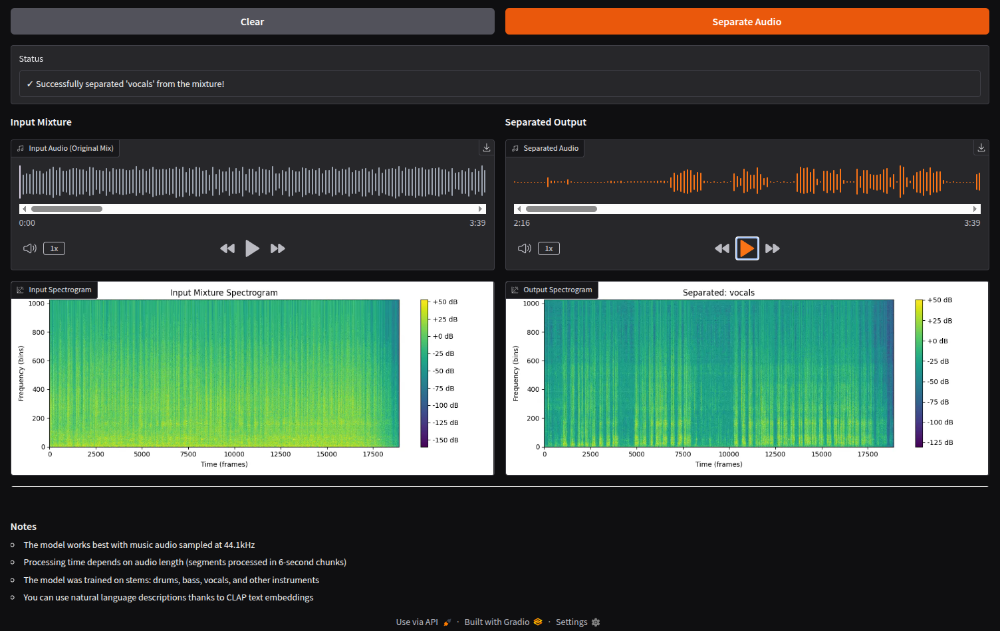

<div align="center">
  <h1>Music Stem Separation with Text-Conditioning using a Transformer Model</h1>
  <p><i>Extracting musical stems (e.g. drums, bass, vocals, etc.) from a mixed audio file</i></p>

  <!-- PyTorch Badge -->
  <a href="https://pytorch.org/" target="_blank" style="text-decoration: none; display: inline-block;">
    
  </a>

  <!-- License Badge -->
  <a href="https://opensource.org/licenses/MIT" target="_blank" style="text-decoration: none; display: inline-block;">
    
  </a>

  <!-- Dataset Badge -->
  <a href="https://sigsep.github.io/datasets/musdb.html" target="_blank" style="text-decoration: none; display: inline-block;">
    
  </a>

  [](https://huggingface.co/spaces/jacob1576/AudioTextHTDemucs)
</div>

## Authors
Jacob Krucinski - [email](mailto:jacob1576@gmail.com) <br>
Maximilian Huber - [email](mailto:huber.maxi@northeastern.edu) <br>
Surya Mani - [email](mailto:mani.su@northeastern.edu) <br>
Noah Smith - [email](mailto:smith.noah@northeastern.edu) <br>

## Python Environment
It is highly recommended to create a new Python 3.13 virtual environment to 
run this repo. If using `conda`, the following commands can be used to create the new environment:
```
conda create -n cs_7150_stem_sep python=3.13
```

As PyTorch is the ML framework used for this project, follow the [PyTorch instructions](https://pytorch.org/get-started/previous-versions/) (with CUDA support if desired) for installation (v.2.6.0 has been tested for this project):
```
pip install torch==2.6.0 torchvision==0.21.0 torchaudio==2.6.0 --index-url https://download.pytorch.org/whl/cu124
```

All remaining dependencies can be installed using pip:
```
pip install -r requirements.txt
```

## Dataset
We are using the [MusDB18](https://sigsep.github.io/datasets/musdb.html) dataset. We create our `torch.Dataset` class
for it. It loads in all segments (of length 6s) for all stems for
all songs. For the text prompts, it uses the original stem name
(drums, bass, vocals, other) as well as slight variants
(i.e. for vocal, "vocals", "voice", "singing", "the vocals" are used as
additional prompts). The dataset can be downloaded for
free from the link above.

## Model Architecture
Our model is built off the existing Hybrid Transformer Demucs 
([HTDemucs](https://github.com/facebookresearch/demucs)) model from Meta.
It consists of 2 parallel U-Net models with skip connections, one for the time/waveform
domain and the other for the frequency domain. It uses a cross-attention
bottleneck layer to learn harmonic representations unique to each stem to aid
in the separation process. Then the decoder parts of this model
use the attended to features and performs
the inverse Short Time Fourier Transform 
([iSTFT](https://www.mathworks.com/help/signal/ref/istft.html#mw_df6a90fa-0796-411d-ab9c-d86cc3c0edec_sep_mw_f4653206-42e2-4878-82ba-66875c98c86c)) 
to convert the final spectrogram to a waveform.
A model diagram provided by the authors is shown below:


We extend this model to support any user-defined stem name
by adding text-conditioning using Contrastive Language-Audio Pairs 
([CLAP](https://github.com/LAION-AI/CLAP)) text embeddings. We then
add another cross-attention between the text embeddings and the combined 
time & frequency embeddings from HTDemucs and modify
the U-Net decoders to only return 1 stem (instead of 4 previously).
This gives the HTDemucs model **zero-shot ability** for stems that
it has not seen before. Even if not explicity trained on that stem,
the CLAP embedding will guide the separatiion based on a similar stem it has trained on.

Our model architecture is shown below. The blue boxes denotes pre-trained and frozen
model components, and the tan represent our modifications that are trained.


More details on our implementation and **audio samples** can be found in our [presentation](https://docs.google.com/presentation/d/1d2muNP3LKTBLZzxt4L7sKxx_nO0klc5U9eKkQvFma6A/edit?usp=sharing).

## Training
To train the model, run the Python scipt `main.py` from the projet root 
directory.
All data, model, and logging configurations are specified in the `config.yaml` file. The full training loop can be found in `src/train.py`.
The YAML configuration file is organized by data,
model, training, and Weights and Biases (wandb) parameters.

The loss functions used are Signal Distortion Ratio (SDR), 
Scale-Invariant SDR (SISDR), a combined loss function using a
linear combination of the SDR and SISDR loss, and lastly a combined L1 + SDR loss.

For logging purposes during training, we use a Weights & Biases (`wandb`) 
project dashboard.
If you also want to use `wandb`, you need to create an account using the instructions [here](https://docs.wandb.ai/models/quickstart#python).

## Model Checkpoints
To avoid training from scratch, the [best model file](https://huggingface.co/jacob1576/AudioTextHTDemucs/tree/main) can be found on HuggingFace.


## Inference
To simplify the inference process, we have created a Gradio demo
which supports uploading a local audio file or using a YouTube link.
To run the gradio app locally, please run:
```
python app.py
```

To run a file upload-only version of the Gradio app,
it is hosted on [HuggingFace_Hub](https://huggingface.co/spaces/jacob1576/AudioTextHTDemucs).

Screenshot of the app is shown below:



For custom inference, the `test-inference.py` file can be modified.


## References
Défossez, A. (2021). Hybrid Spectrogram and Waveform Source Separation. Proceedings of the ISMIR 2021 Workshop on Music Source Separation.

Wu*, Y., Chen*, K., Zhang*, T., Hui*, Y., Berg-Kirkpatrick, T., & Dubnov, S. (2023). Large-scale Contrastive Language-Audio Pretraining with Feature Fusion and Keyword-to-Caption Augmentation. IEEE International Conference on Acoustics, Speech and Signal Processing, ICASSP.

Ma, H., Peng, Z., Li, X., Shao, M., Wu, X., & Liu, J. (2024). CLAPSep: Leveraging Contrastive Pre-trained Models for Multi-Modal Query-Conditioned Target Sound Extraction. arXiv Preprint arXiv:2402. 17455.